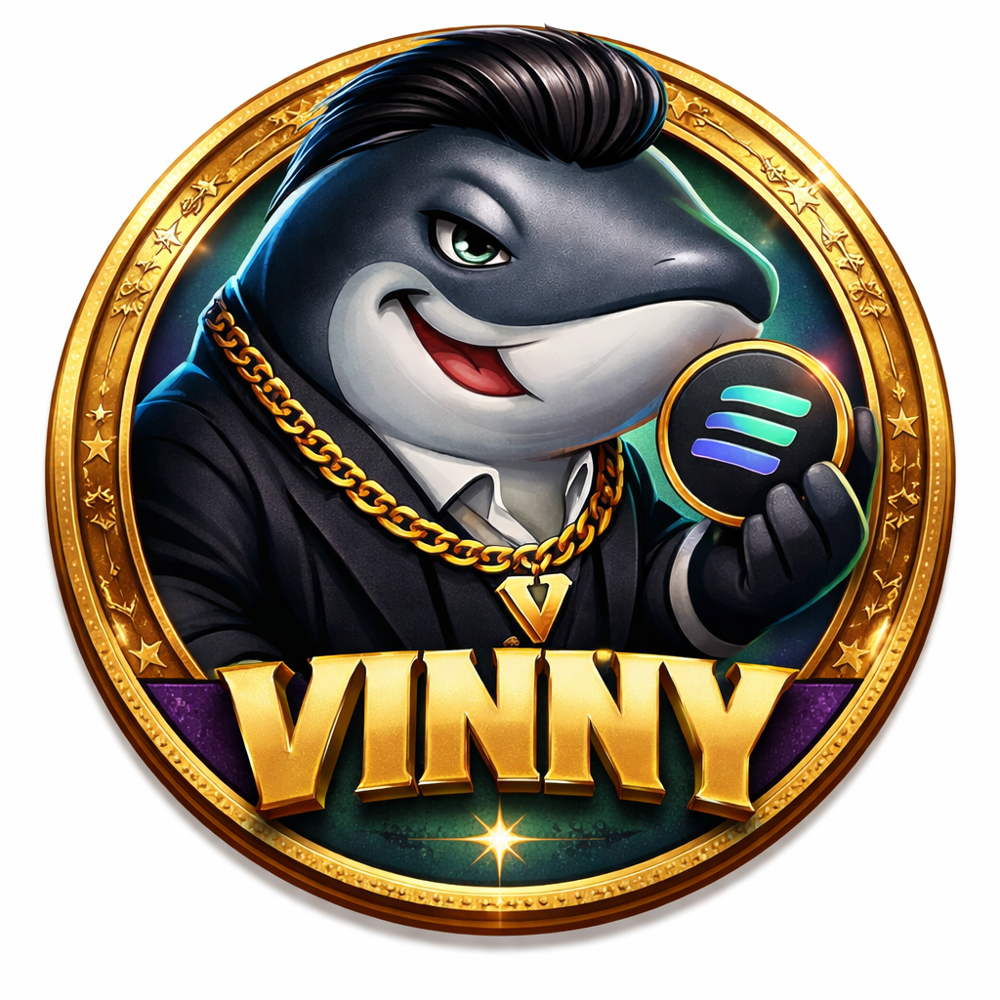

# VINNY



**VINNY — The Boss of the Whale Culture Ecosystem**


---

## Overview

VINNY is a community-driven meme token built on the Solana blockchain.
In the crypto ocean, whales move the markets — but behind every whale, someone is calling the shots.

That boss is **VINNY**.

VINNY is the leading token of the **Whale Culture ecosystem**, designed to represent strategy, community growth, and the culture of crypto whales.

---

## Token Details

**Name:** VINNY
**Symbol:** VINNY
**Network:** Solana
**Total Supply:** 1,000,000,000

Mint authority has been revoked to ensure a fixed supply.

---

## Token Distribution

| Allocation        | Amount      |
| ----------------- | ----------- |
| Treasury          | 600,000,000 |
| Liquidity         | 300,000,000 |
| Marketing         | 40,000,000  |
| DEX Operations    | 40,000,000  |
| Community Rewards | 20,000,000  |

---

## Token Security

VINNY was created with transparency and security in mind.

* Fixed supply
* Mint authority revoked
* Built on the Solana blockchain

---

## Whale Culture Ecosystem

The ecosystem currently includes two primary tokens:

**VINNY**
The strategic leader and central token of the ecosystem.

cryptowhale.png.png

**CRYPTOWHALE**
The market-moving whale representing liquidity and trading power.

```
        Whale Culture
            │
            │
       ┌────┴────┐
       │         │
     VINNY   CRYPTOWHALE
     (Boss)   (Whale)
```

Together they represent the culture of whales influencing crypto markets.

---

## Website

Official Website
*(add website link here)*

---

## Live Chart

Chart will be available once liquidity is live.

*(add Dexscreener link here)*

---

## Contract Address

VINNY Contract Address:

```
ADD_CONTRACT_ADDRESS_HERE
```

---

## Community

Follow the Whale Culture ecosystem for updates.

Twitter / X: *(add link)*
Telegram: *(add link)*

---

## Disclaimer

VINNY is a community-driven meme token created for entertainment and community engagement.
It does not represent financial advice or investment guarantees. Cryptocurrency investments carry risk.
